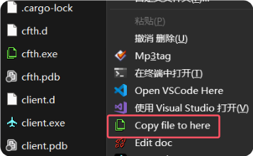

# CFTH 使用指南

## 介绍

`cfth` Copy File To Here 是一个文件复制工具，允许用户通过右键菜单将匹配的文件复制到指定目录。
它可以读取剪切板中的项目编号，并用 everything 搜索文件，复制到指定目录。

## 安装

### 前置条件

- 需要安装 [server](getting-started.md)
- 需要安装 [everything](https://www.voidtools.com/)

### 下载

1. 前往 [GitHub Releases 页面](https://github.com/initialencounter/Ziafp/releases/latest) 下载 `cfth.exe`。
2. 如果下载过程中被杀毒软件阻止，请退出所有杀毒软件并选择保留程序。

### 修改注册表

1. 双击 `cfth.exe`，在弹出的用户账户控制窗口中，点击“是”。
2. 如果在文件管理器右键菜单中看到 `Copy file to here`，那么恭喜你，CFTH 的安装已完成。

### 启动 everything http server

打开 everything 的选项，启用 http 服务，并设置端口为 25456。

### 开始使用

1. 打开要处理的文件夹，右键点击 `Copy file to here` 即可执行相关操作。

`cfth.exe` 会根据配置文件中的信息和文件夹内容执行相应的任务。

