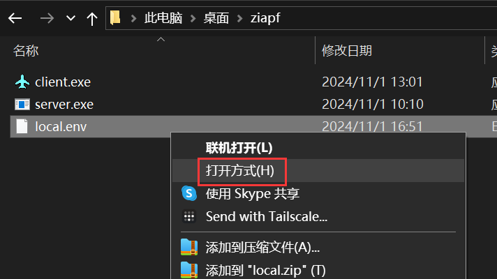
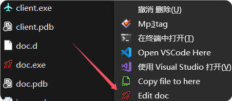

# 快速开始

本章节主要介绍 Ziafp 的安装与配置

## 安装

### 下载

### 新建一个文件夹，用于存放程序和配置文件

文件夹名称可以随便取，位置尽量放在方便找到的地方
因为每次电脑开机都要启动 server.exe

### 前往 release 页面下载 server.exe 和 client.exe

[点我前往]https://github.com/initialencounter/Ziafp/releases/latest


如果被杀毒软件阻止，可以按照以下步骤进行操作
1. 退出所有杀毒软件
2. 保留程序


### 创建配置文件

打开上面创建的文件夹
新建一个文本文件，命名为 local.env


选择打开方式为记事本



写入下面的内容，并保存
```
BASE_URL=系统的域名
USER_NAME=主检员的账号
PASSWORD=主检员的密码
PORT=25455
```
系统的域名，主检员的账号，主检员的密码需要按实际情况来填写


### 修改注册表

按win键，输入powershell，以管理员身份允许

复制刚才创建的文件夹路径

输入刚才复制的路径+\client.exe 回车


如果你在文件管理器右键，看到了这个菜单

那么恭喜你完成了ziafp的安装